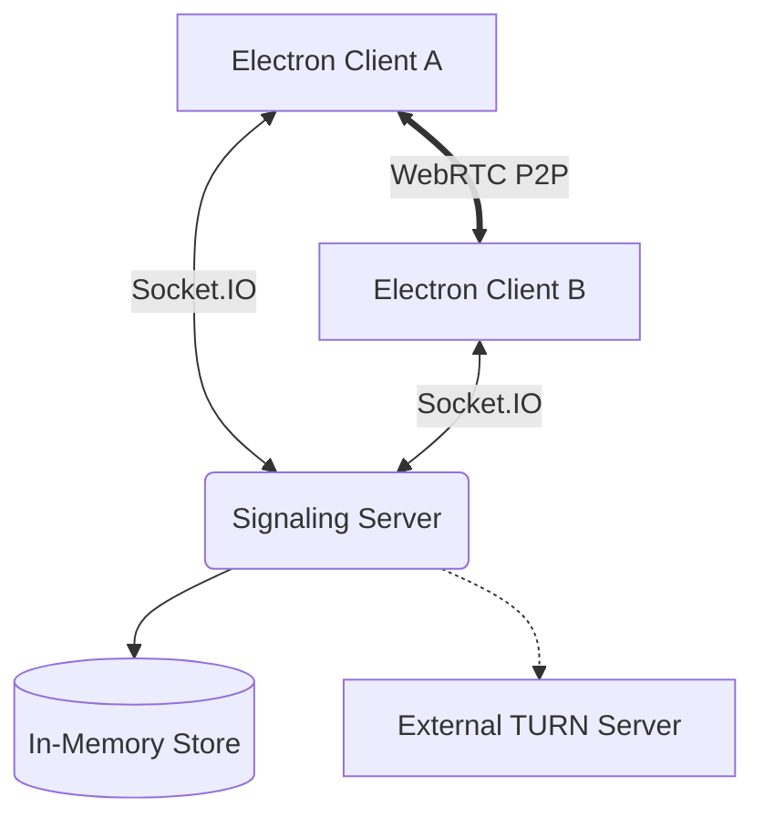

# Architecture

CinePair is designed as a lightweight, ephemeral signaling system. It follows a **Hub-and-Spoke** model for signaling, where the backend acts as the central hub for metadata, but the actual video/audio data flows **Peer-to-Peer (P2P)**.

## Component Breakdown

### 1. The Hub (FastAPI + Socket.IO)
- **Stateful Signaling**: Keeps track of who is in which room and their current socket.
- **Validation**: Ensures that only authorized users can relay signals or change room settings.
- **Authentication**: Issues and verifies JWTs for anonymous sessions.

### 2. The Store (MemoryRoomStore)
- An abstraction layer over a standard Python dictionary.
- Stores `Room`, `RoomUser`, and `StoredChatMessage` objects.
- **Why Memory?** For privacy and performance. We don't want to persist private watch-party data on disk.

### 3. The Services
- **RoomService**: The "Brain". Handles the logic of joining, leaving, and setting updates.
- **TokenService**: Handles JWT signing and verification.
- **IceService**: Generates time-limited credentials for TURN servers using HMAC-SHA1.

## Data Flow Diagrams

### Establishing a Connection
1. **Client A** creates room -> Backend stores room.
2. **Client B** joins room -> Backend notifies Client A.
3. **Backend** emits `peer:start-negotiation`.
4. **Client A** sends Offer -> Backend relays to **Client B**.
5. **Client B** sends Answer -> Backend relays to **Client A**.
6. **P2P Connection** is established.

### Chat Propagation
1. **Client A** sends `chat:message`.
2. **Backend** validates JWT and checks `chat_disabled` setting.
3. **Backend** stores message in a small ring buffer (for re-sync).
4. **Backend** broadcasts to all other members in the room code.

## Service Responsibilities

| Service | Responsibility |
|---------|----------------|
| **HTTP API** | Room discovery, initial join validation, health/metrics. |
| **Presence Gateway** | Socket connection lifecycle, room membership, reconnections. |
| **Signaling Gateway** | WebRTC relay (SDP/ICE), chat messages, screen share toggles. |
| **Background Tasks** | Purging expired rooms (24h) and expired reconnections (90s). |

## Scalability Notes
- Currently, the backend is designed for **single-instance** deployment (In-Memory).
- To scale horizontally, the `MemoryRoomStore` would need to be replaced with a `RedisRoomStore`, and Socket.IO would need a Redis Adapter for cross-process broadcasting.
